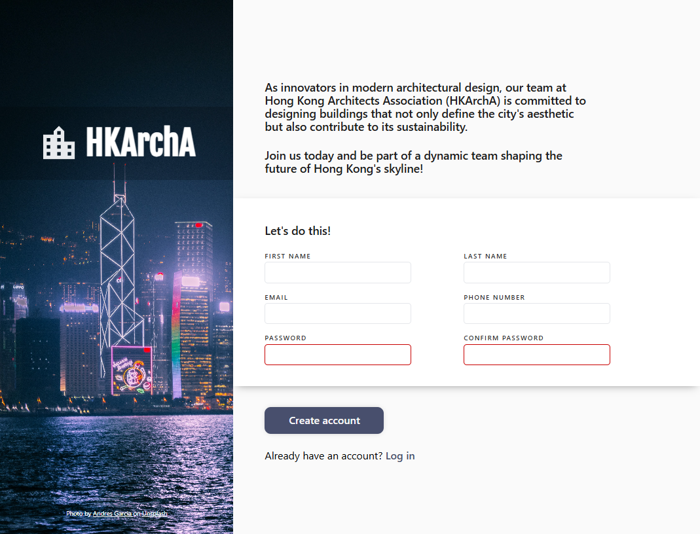

    

<h1>HKArchA Sign-up Page</h1>

Natalie Wong | February 16, 2025

HKArchA is a simple yet elegant sign-up form created with vanilla HTML, CSS, and JavaScript.
It is fully responsive, ensuring optimal display across all devices (RWD), and was developed as part of <a href="https://www.theodinproject.com/dashboard">The Odin Project</a>'s Full Stack JavaScript curriculum.
